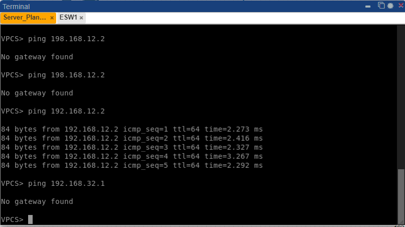
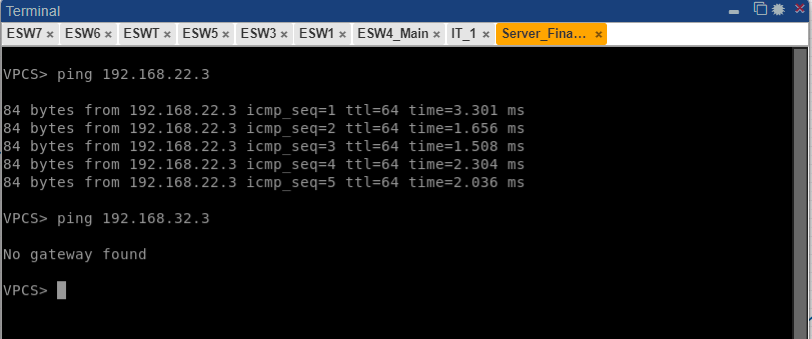

# Comandos usados

## Para la creacion de VTP:

### Set VTP en modo Servidor:

vtp mode server

### Set VTP en modo Cliente:

vtp mode client

### Set VTP en modo transparent:

vtp mode transparent

### Asignar dominio:

vtp domain 201021212

vtp password usac

## Para setear los puertos en trunk mode:

int ex/y

switchport trunk encapsulation dot1q

switchport mode trunk

## Crear vlans:

vlan VLAN_NUMBER

name VLAN_NAME

## Asignar vlans a puertos:

int ex/y

switchport mode access

switchport mode vlan VLAN_NAME

## Para revisar status de vlan y vtp:

do show vtp

do show vlan

do show vlan brief

## Set STP:

spanning-tree mode rapid-pvst

## Set ips en vpcs:

ip IP_NUMBER

save

## Pings entre las vpcs:

